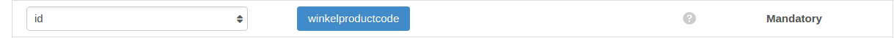
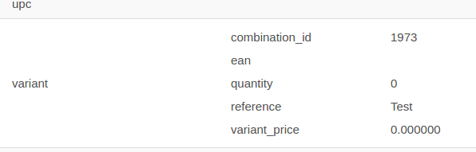
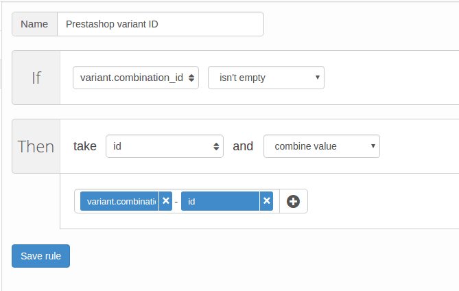

# Channable integratie

Het is mogelijk om de module in combinatie met een 3e partij zoals Channable te gebruiken. Hiervoor is het wel nodig dat bij Channable de opmaak van het id wordt ingesteld. Wanneer je gebruik maakt van de standaard instelling, is het goed mogelijk dat deze nog niet goed staat. De instellingen hieronder zorgen ervoor dat je met de `Standaard` productmatcher instelling van de module kunt werken.

## Product IDs

In de feed moet een product ID worden opgegeven dat overeenkomt met het product ID dat wordt teruggemeld door de Order API. Binnen Channable is dit veld bekend als de `winkelproductcode`. Dit veld staat standaard ingesteld op het Prestashop database ID van het product.

Controleer of dit ook daadwerkelijk het geval is. Dit kun je doen op de tab `finalize` van je Beslist Winkelwagen channel. Hier moet het veld `winkelproductcode` ingesteld staan op `id`.



**Controleer ook op de `rules` tab of er geen regels zijn die het id aanpassen. De enige aanpassing aan het `id` veld is de aanpassing die hieronder staat beschreven.**

## Productcombinatie IDs

Indien je webshop gebruik maakt van productcombinaties (producten met verschillende maten/kleuren) moet je een regel aan je Beslist Winkelwagen Channel toevoegen, zodat de combinatie in plaats van het product wordt gestuurd.

Als je producten gebruik maken van combinaties heb je op het productscherm van Channable als het goed is een variant veld (zie afbeelding hieronder). Indien dat niet het geval is, kun je contact opnemen met Channable om dit te laten aanpassen.



Indien je het variant veld hebt, kun je een regel maken zodat het `id` wordt aangepast wanneer het product een combinatie betreft. Dit doe je door een nieuwe regel aan te maken bij de `Rules` tab van je Beslist Winkelwagen channel. De regel moet de volgende instellingen hebben:

- `Name`: Prestashop variant ID
- `If`: variant.combination_id isn't empty
- `Then`: take `id` and `combine value`: `variant.combination_id`-`id` (klik op de plus en klik in het blauwe vakje om een veld te selecteren)

Als het goed is ziet de regel er dan als volgt uit:



## Controle

Je kunt nu in je feed kijken naar het product. Het product waarvoor de combinatie bestaat moet nu een veld

```xml
 <winkelproductcode>id_combinatie-id_product</winkelproductcode>
```
 hebben. Ook moet voor de producten zonder combinaties het veld eruit zien als

```xml
<winkelproductcode>id_product</winkelproductcode>
```
