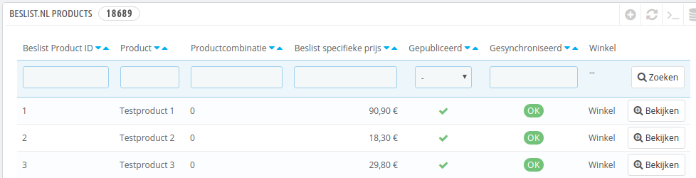
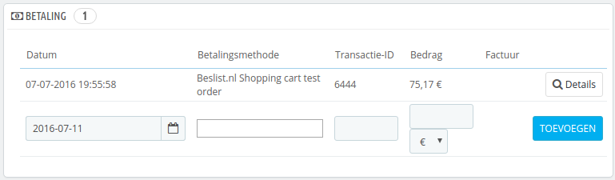

# Test orders

De eerste test die uitgevoerd dient te worden is de orders synchronisatie.

***Kijk goed na of u de module in [testmodus heeft geconfigureerd](../configuratie/module)***

Na het installeren van de module zijn er nieuwe opties in het menu van Prestashop gekomen. Een daarvan is `Bestellingen` -> `Beslist.nl orders`. Wanneer u daar naartoe navigeert, ziet u een overzicht van alle Beslist bestellingen in het systeem (zowel van Beslist.nl als Beslist.be).

## Testproduct aanmaken
Om de test te kunnen gebruiken dient u eerst een product te hebben die correspondeert met het product dat Beslist gaat melden. Hiervoor is het nodig om een product in Prestashop aan te maken (of tijdelijk een bestaand product te wijzigen).

1. Maak een (tijdelijk) product, bijv. `Beslist testproduct`.
2. Vul een naam voor het product in.
3. Vul een referentiecode voor het product in.
4. Vul bij de `EAN-13 of JAN-streepjescode` een geldige code in.
5. Zorg ervoor dat het product op voorraad is (dus bestelbaar).
6. Zet het product in een categorie.
7. Sla het product op.
8. Zet in de module instellingen het `Beslist productreferentie veld` goed (zie [module configuratie](../configuratie/module)).
9. Zet in de module instellingen het `Test productnummer` goed (zie [module configuratie](../configuratie/module)).

## België activeren
Indien u alleen in Nederland levert, is het toch van belang om België heel tijdelijk aan te zetten. Dit is nodig omdat de Order API willekeurige data terugstuurt. Soms dus een Nederlands adres, maar soms ook een Belgisch adres. Als België niet geactiveerd is, komt er een foutmelding bij een Belgische order.

## Orders verkrijgen
Navigeer naar `Bestellingen` -> `Beslist.nl orders`. Als het goed is ziet u bovenin 2 knoppen: `Synchroniseer bestellingen` en `Verwijder testdata`.

***Let op: Indien u `Verwijder testdata` niet ziet hebt u de module niet in testmodus staan! Ook moet u eerst een testproduct hebben aangemaakt, zie hierboven***

Klik bovenin op de knop `Synchroniseer bestellingen`. U ontvangt nu als het goed is een testorder van Beslist. Belangrijk is dat de verzendkosten kloppen. Klopt het totaalbedrag ook? De prijs van het product wijkt hoogstwaarschijnlijk af van uw prijs, maar het betaalde bedrag (en de verzendkosten) moet kloppen met de orderdetails (wanneer dit niet zo is laat Prestashop de status `Betalingsfout` zien).

## Verwijder testdata
U kunt de orders verwijderen via de knop `Verwijder testdata`. De orders en alle verwante informatie (orderregels, klanten etc.) zullen worden verwijderd.
