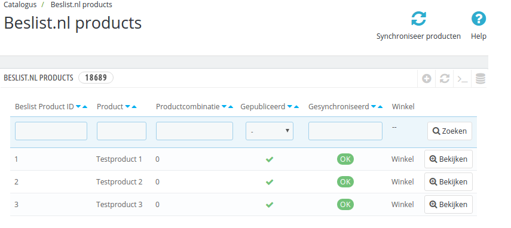
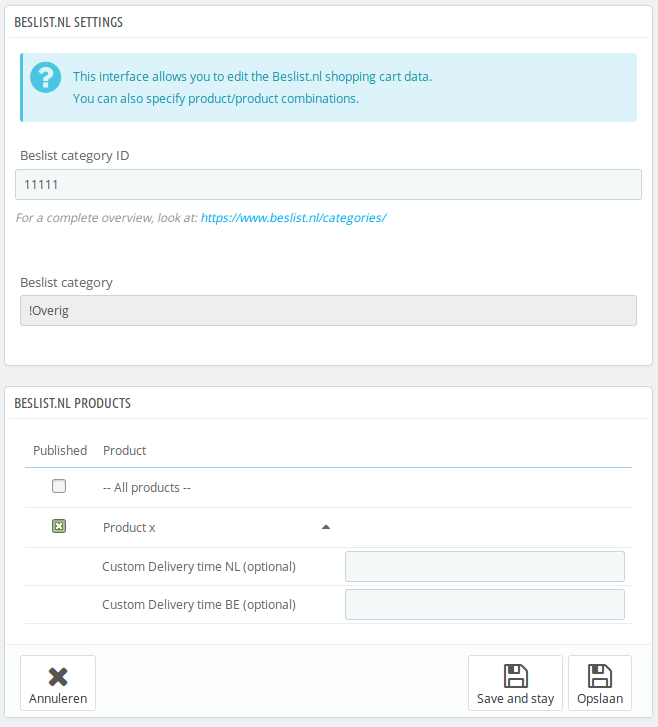

# Test producten

De tweede test die uitgevoerd dient te worden is de producten synchronisatie.

***Kijk goed na of u de module in [testmodus heeft geconfigureerd](../configuratie/module)***

Na het installeren van de module zijn er nieuwe opties in het menu van Prestashop gekomen. Een daarvan is `Catalogus` -> `Beslist.nl producten`. Wanneer u daar naartoe navigeert, ziet u een overzicht van alle producten in het systeem die op Beslist gepubliceerd worden (zowel Beslist.nl als Beslist.be).

## Producten selecteren
Binnen Prestashop dient u per product in te stellen hoe deze op Beslist.nl en Beslist.be weergegeven dient te worden. Op de product bewerkpagina (onder `Catalogus`) vindt u een nieuwe tab met de titel `Beslist.nl Winkelwagen integratie`. Op die tab staan de instellingen voor Beslist.

Op de tab staat bovenaan welke Beslist productcategorie gebruikt moet worden. U kunt zoeken in het veld door te typen. Selecteer een categorie voor uw product. Dit is optioneel, het kan zijn dat Beslist de mapping voor uw producten aan hun kant instelt.

Op deze tab ziet u ook voor alle productcombinaties een optie om deze te publiceren (via het vinkje onder `Publiceren`). Ook kunt u per combinatie een specifieke Beslist levertijd instellen (klik op het product om deze velden te tonen). Klik voor een product aan dat deze op Beslist gepubliceerd moet worden en sla het product op.

## Producten synchroniseren
Wanneer er een nieuw product wordt geselecteerd voor Beslist, wordt deze pas na de volgende productfeed run meegenomen. Het duurt dus meestal een tijd voordat uw product pas zichtbaar is. Nadat het product zichtbaar is kunnen voorraad en prijsupdates wel snel verwerkt worden.

U kunt de status van de productsynchronisatie inzien op de `Catalogus` -> `Beslist.nl products` pagina. Indien de melding naar Beslist mislukt, staat de status nog op `Nieuw`.

Als er een andere status dan `OK` staat kunt u de knop `Synchroniseer producten` bovenin gebruiken om de producten te synchroniseren. De module zal de gewijzigde produten opnieuw aan Beslist proberen aan te bieden.

## Testdata verwijderen
In het `Bewerk product` scherm kunt u het vinkje bij `Publiceren` verwijderen en de levertijden leegmaken. Hiermee wordt het product van Beslist verwijderd. De voorraad wordt op 0 gezet, waardoor mensen het niet zullen bestellen. Na de volgende productfeed run is het product daadwerkelijk weg van Beslist.
